## spring-myapp-service

This service contains Login, registration, home and input message with different language page.

How to **run** service on local:

- Clone [myappService](https://github.com/misidev/myappService).
- Configure java 18 SDK and apache-maven-3.9.6
- Run the Spring Boot application.
- Open Browser and go on [logIn page](http://localhost:8087/api/v1/myapp/login)
- To access additional pages, logging in is required.
- Pages links: [Registration](http://localhost:8087/api/v1/myapp/registration), [Home page](http://localhost:8087/), and [Message and language input](http://localhost:8087/api/v1/myapp/adminMessageInput). 
- The home page is built on a React application, which has been integrated into the static folder of the Spring Boot application. 
In case there are any issues with accessing the home page, you can clone the [React application](https://github.com/MiliSii/NineballReactApp/tree/main/nineball/my-app) repository, build it, and then copy its contents into the static folder.

## Endpoints in spring-myapp-service

### 1. LogIn

- **URL**: `/api/v1/myapp/login`
- **Method**: GET
- **Description**: Get logIn page from template.
- **Example Request**:
  ```bash
  curl -X GET "http://localhost:8087/api/v1/myapp/login"
- **Response**:

  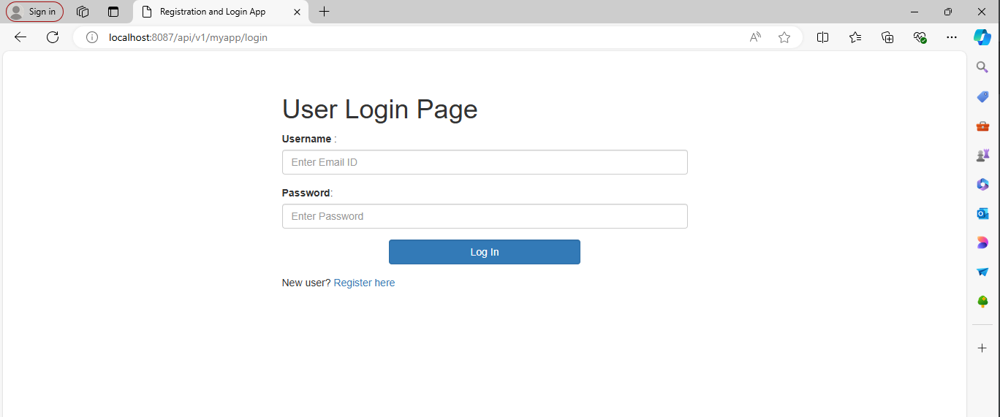
- **Invalid data - user is not registered**:
  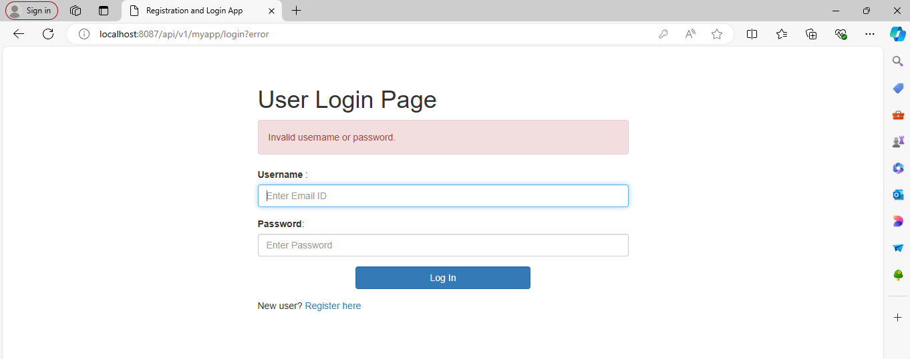


### 2. Registration

- **URL**: `/api/v1/myapp/registration`
- **Method**: GET
- **Description**: Get Registration page from template.
- **Security**: This page is restricted if user is not logged in.
- **Example Request**:
  ```bash
  curl -X GET "http://localhost:8087/api/v1/myapp/registration"
- **Response**:

  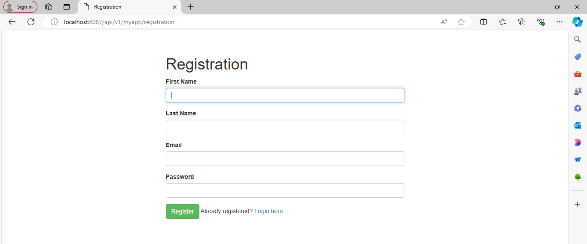
- **Invalid data - data for input is validated in service and also in js**:
  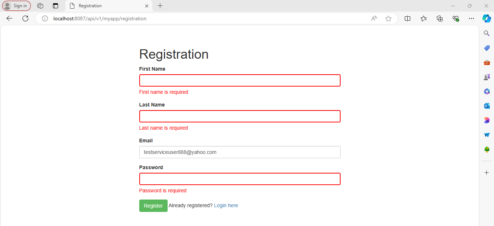
  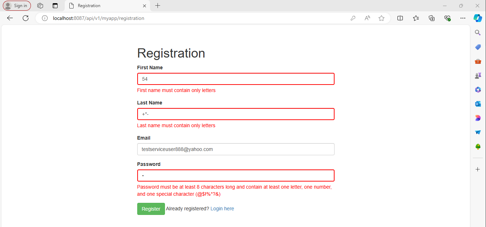
  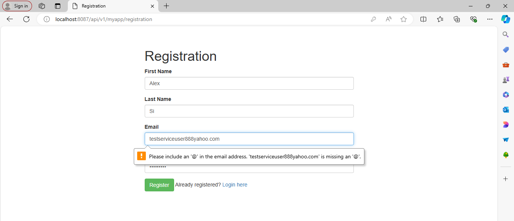
  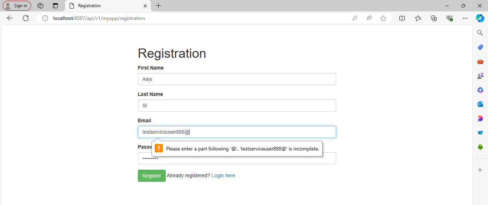
  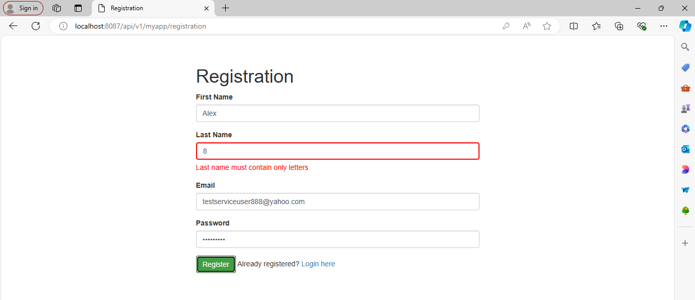
  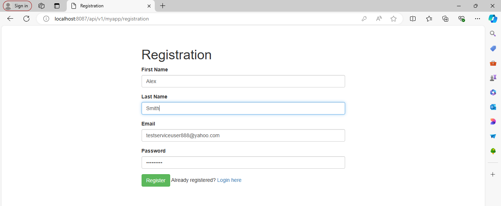

Validation for the input data displayed in the photos above has been implemented in [JavaScript](https://github.com/misidev/myappService/blob/0d149d0e7380cedc007c0d044a34324dcdf90a21/spring-myapp-service/src/main/resources/templates/registration.html#L72) within the HTML file. 
* Error response example (backend - error in validation before adding data to DB)
  This is an example of the service response validation - [service validation](https://github.com/misidev/myappService/blob/0d149d0e7380cedc007c0d044a34324dcdf90a21/spring-myapp-service/src/main/java/com/myapp/spring_myapp_service/impl/UserServiceImpl.java#L76).
```
{
    "error": {
        "status": "failure",
        "code": 500,
        "message": "Internal Server Error",
        "details": "Validation data input Error while saving user in DB UserValidationException"
    }
}
```
* Example of logs error while validating
```
2024-06-18 21:39:44.739  INFO 10732 --- [nio-8087-exec-6] com.example.demo.impl.UserServiceImpl    : Errors occurred while validating input data: [Invalid first name, Invalid last name, Invalid email format, Invalid password format]
2024-06-18 21:39:44.754  INFO 10732 --- [nio-8087-exec-6] c.e.demo.advice.GlobalExceptionHandler   : Validation data input Error while saving user in DB: UserValidationException, 500 INTERNAL_SERVER_ERROR
```
* Example of logs for success input in DB
```
2024-06-18 21:54:19.684 DEBUG 1392 --- [nio-8087-exec-3] org.hibernate.SQL                        : insert into user (id, email, first_name, last_name, password) values (default, ?, ?, ?, ?)
Hibernate: insert into user (id, email, first_name, last_name, password) values (default, ?, ?, ?, ?)
2024-06-18 21:54:19.687 TRACE 1392 --- [nio-8087-exec-3] o.h.type.descriptor.sql.BasicBinder      : binding parameter [1] as [VARCHAR] - [testserviceuser888@yahoo.com]
2024-06-18 21:54:19.688 TRACE 1392 --- [nio-8087-exec-3] o.h.type.descriptor.sql.BasicBinder      : binding parameter [2] as [VARCHAR] - [Alex]
2024-06-18 21:54:19.688 TRACE 1392 --- [nio-8087-exec-3] o.h.type.descriptor.sql.BasicBinder      : binding parameter [3] as [VARCHAR] - [Eric]
2024-06-18 21:54:19.689 TRACE 1392 --- [nio-8087-exec-3] o.h.type.descriptor.sql.BasicBinder      : binding parameter [4] as [VARCHAR] - [$2a$10$jHdpugdQlBiG3VSQiXNxTOIxiAaekKzSrAzi6xIWnjaSe1gADA/nW]
2024-06-18 21:54:19.736 DEBUG 1392 --- [nio-8087-exec-3] org.hibernate.SQL                        : insert into role (id, name) values (default, ?)
Hibernate: insert into role (id, name) values (default, ?)
2024-06-18 21:54:19.737 TRACE 1392 --- [nio-8087-exec-3] o.h.type.descriptor.sql.BasicBinder      : binding parameter [1] as [VARCHAR] - [ROLE_USER]
2024-06-18 21:54:19.841 DEBUG 1392 --- [nio-8087-exec-3] org.hibernate.SQL                        : insert into users_roles (user_id, role_id) values (?, ?)
Hibernate: insert into users_roles (user_id, role_id) values (?, ?)
2024-06-18 21:54:19.860 TRACE 1392 --- [nio-8087-exec-3] o.h.type.descriptor.sql.BasicBinder      : binding parameter [1] as [BIGINT] - [1]
2024-06-18 21:54:19.861 TRACE 1392 --- [nio-8087-exec-3] o.h.type.descriptor.sql.BasicBinder      : binding parameter [2] as [BIGINT] - [1]
2024-06-18 21:54:19.861  INFO 1392 --- [nio-8087-exec-3] com.example.demo.advice.LoggingAspect    : Execution time of class: CrudRepository and method: save  :: 453 ms
2024-06-18 21:54:19.861  INFO 1392 --- [nio-8087-exec-3] com.example.demo.advice.LoggingAspect    : Execution time of class: UserServiceImpl and method: save  :: 892 ms
2024-06-18 21:54:19.861  INFO 1392 --- [nio-8087-exec-3] c.e.d.a.c.UserRegistrationController     : User with First Name: Alex, Last Name: Eric and Email: testserviceuser888@yahoo.com is saved in DB!
2024-06-18 21:54:19.861  INFO 1392 --- [nio-8087-exec-3] com.example.demo.advice.LoggingAspect    : Execution time of class: UserRegistrationController and method: registerUserAccount  :: 893 ms
2024-06-18 21:54:19.923  INFO 1392 --- [nio-8087-exec-4] com.example.demo.advice.LoggingAspect    : Execution time of class: UserRegistrationController and method: userRegistrationDto  :: 0 ms
2024-06-18 21:54:19.928  INFO 1392 --- [nio-8087-exec-4] com.example.demo.advice.LoggingAspect    : Execution time of class: UserRegistrationController and method: showRegistrationForm  :: 0 ms
```

### 3. Message and language input

- **URL**: `/api/v1/myapp/adminMessageInput`
- **Method**: GET, POST
- **Description**: GET REQUEST - load Message and language input page from template, POST REQUEST - add input data in DB - TODO: Input and save in DB translation of pages.
- **Security**: This page is restricted if user is not logged in.
- **Example Request**:
  ```bash
  curl -X GET "http://localhost:8087/api/v1/myapp/adminMessageInput"
- **Response**:
  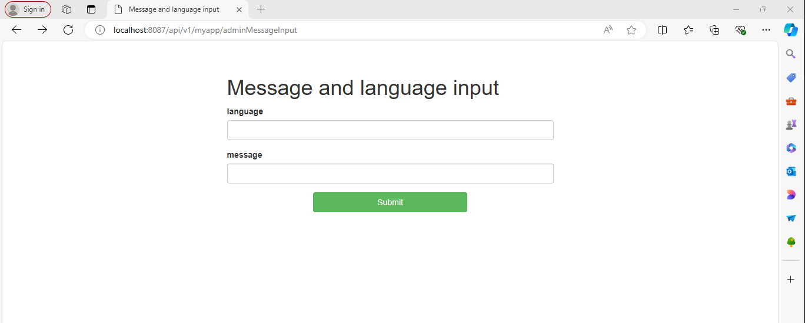

### 4. Get Message and language for hello

- **URL**: `/api/v1/myapp/hello?lang={language}`
- **Method**: GET, POST
- **Description**: GET REQUEST - load Message and language input page from template, POST REQUEST - add input data in DB - TODO: Return translated pages.
- **Security**: This page is restricted if user is not logged in.
- **Example Request**:
  ```bash
  curl -X GET "http://localhost:8087/api/v1/myapp/hello?lang=en"
- **Response**:
```json
    [
      {
        "id": 2,
        "messageDifLang": "hello",
        "lang": "en"
      }
    ]
```

### 5. Home page - React app on 
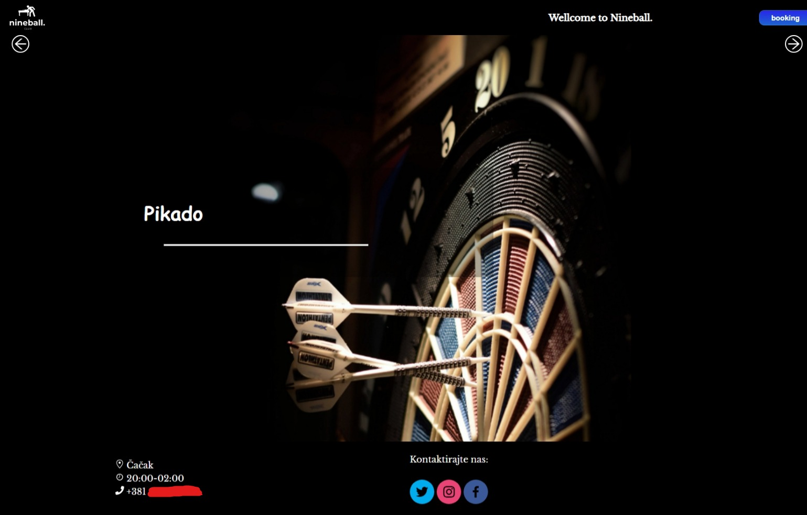


PLANED IMPROVEMENT:
- Add data input validation on frontend/backend for /adminMessageInput - when data (email) is already in use
- Add translated login/registration/home page based through /adminMessageInput endpoint logics and display with query for lang (example: /login?lang=en)
- Add admin users with "ADMIN-ROLE" and allow only admin users to access /adminMessageInput
- Change React Home page - Create a different style of home page for guest users and add buttons for login/registration to it.
- Change React Home page - Also, add buttons for profile, settings, and a logout button to the home page for logged-in users.
- Change React Home page - Create a different style of home page for admin users, add button with redirection to input message for language page /adminMessageInput.
- Add other functionality, validation of elements for all home pages 
- Add in DB new ROLE for guest user and additional logics
- Add username and confirm password in UI and in Entity for registration part (username is unique and password is equal to confirm password)
- Add Small and Medium tests
- Implement Lombok

Feel free to add "Issues" with improvement ideas!
